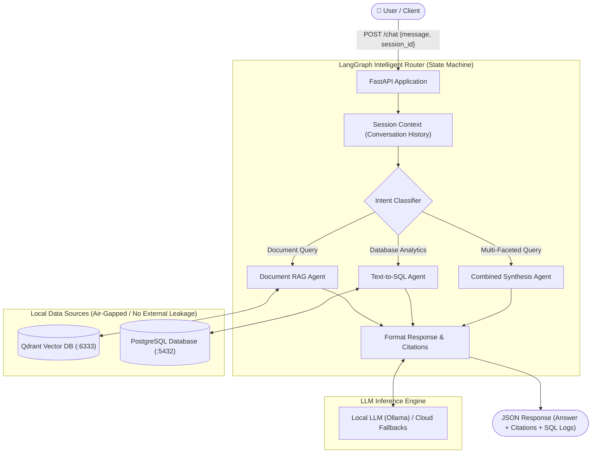

# Local GenAI Data Assistant

An enterprise-grade, fully local GenAI assistant built with Python, FastAPI, LangGraph, Qdrant, PostgreSQL, and Ollama.

The application allows users to converse naturally with both **unstructured enterprise documents** and **relational SQL databases**, orchestrating queries dynamically through a LangGraph state machine.

---

## 🏛️ System Architecture



---

## ✨ Features & Requirements Fulfillment

### 1. Document RAG (`data/documents/`)
* **Multi-Format Ingestion:** Natively parses `.pdf`, `.docx`, `.txt`, and `.md` files.
* **Chunking & Embeddings:** Sliding-window character chunking (500 tokens, 100 overlap) and dense vector embeddings (`BAAI/bge-small-en-v1.5`).
* **Vector Database:** Fast semantic similarity search with **Qdrant**.
* **Source Citations:** Every document response explicitly cites the source filename and chunk context.

### 2. Text-to-SQL Agent
* **Relational Schema:** PostgreSQL database seeded with `customers`, `products`, `orders`, and `order_items` (`data/sql/init.sql`).
* **Schema-Aware Prompting:** Dynamic introspection reflects live table DDL, types, and column constraints.
* **Security & Guardrails:** Strict SQL validation blocking `DROP`, `DELETE`, `UPDATE`, `INSERT`, `ALTER`, `TRUNCATE`, and multi-statement injection. Only read-only `SELECT` queries are permitted.
* **Self-Healing Loop:** Automatically catches database syntax or column errors, feeds them back to the LLM, and self-corrects up to 2 retries.
* **Query Logging:** Records execution latency, row counts, and database metadata.

### 3. Intelligent Routing (LangGraph)
* Evaluates user intent into:
  * `rag`: Document policies, SLAs, guidelines (e.g., *"What is the company's leave policy?"*).
  * `sql`: Relational analytics and aggregations (e.g., *"Which are the top 5 customers by revenue?"*).
  * `combined`: Questions requiring both (e.g., *"What is the refund policy and how much was refunded last month?"*).
* **Conversation Memory:** Multi-turn session tracking keyed by `session_id`.

### 4. REST API (FastAPI)
* `POST /chat`: Unified conversational entrypoint with router and history.
* `POST /documents/ingest`: Bulk-ingests all documents from `data/documents/`.
* `GET /documents`: Lists all indexed documents, chunk counts, and metadata.
* `DELETE /documents/{id}`: Purges a specific document from the vector store.
* `GET /health`: Comprehensive diagnostic status of API, database, Qdrant, and LLM.

---

## 📁 Repository Structure

```
.
├── Dockerfile                  # Container definition for FastAPI application
├── docker-compose.yml          # Orchestrates API, PostgreSQL, Qdrant, and Ollama
├── requirements.txt            # Python dependencies
├── .env.example                # Configuration template
├── app/
│   ├── main.py                 # FastAPI entrypoint, CORS, and startup lifespan
│   ├── config.py               # Pydantic environment configuration
│   ├── core/
│   │   └── llm.py              # LLM factory (Ollama, Groq, Gemini with auto-failover)
│   ├── rag/
│   │   ├── loader.py           # Multi-format document parser (.pdf, .docx, .txt, .md)
│   │   ├── embeddings.py       # Dense vector embedding manager (FastEmbed)
│   │   ├── vector_store.py     # Qdrant client wrapper (remote server & embedded)
│   │   └── pipeline.py         # Document ingestion, similarity search & RAG pipeline
│   ├── sql/
│   │   ├── db.py               # SQLAlchemy connection with Postgres & SQLite fallback
│   │   ├── validator.py        # Strict SELECT-only AST/regex safety validator
│   │   └── agent.py            # Natural Language to SQL agent with self-healing
│   ├── graph/
│   │   ├── state.py            # LangGraph AgentState schema
│   │   └── router.py           # State machine router (RAG, SQL, Combined)
│   └── api/
│       ├── health.py           # GET /health
│       ├── chat.py             # POST /chat
│       └── documents.py        # POST /documents/ingest, GET /documents, DELETE /documents/{id}
├── data/
│   ├── documents/              # Sample business documents (7 files: PDF, DOCX, TXT, MD)
│   └── sql/
│       └── init.sql            # PostgreSQL schema and seed analytics data
├── tests/
│   ├── test_sql.py             # Unit tests for SQL Agent, schema reflection & safety
│   └── test_api.py             # Integration tests for all 5 FastAPI endpoints
└── chat.py                     # Interactive terminal CLI chat interface
```

---

## 🚀 Running the Project

### Option 1: Full Local Stack via Docker Compose (Recommended)

To run the entire system locally:
```bash
docker compose up --build
```

This spins up:
* **FastAPI Backend:** [http://localhost:8000](http://localhost:8000) (Interactive Swagger docs: [http://localhost:8000/docs](http://localhost:8000/docs))
* **PostgreSQL:** `localhost:5432` (Auto-seeded with customer and orders data)
* **Qdrant Vector DB:** `http://localhost:6333/dashboard`
* **Ollama (Local LLM):** `http://localhost:11434`

To pull a local model for Ollama:
```bash
docker exec -it ai_ollama ollama pull llama3.2
```

---

### Option 2: Running Locally with Python Virtual Environment

```bash
# 1. Activate virtual environment
source .venv/bin/activate

# 2. Run the automated test suite
python -m unittest tests/test_sql.py tests/test_api.py

# 3. Start the FastAPI development server
uvicorn app.main:app --reload --host 0.0.0.0 --port 8000

# 4. Or use the interactive CLI chat
python chat.py
```

---

## 📡 API Documentation & Sample Requests

### 1. Chat (`POST /chat`)

#### Natural Language SQL Query:
```bash
curl -X POST http://localhost:8000/chat \
  -H "Content-Type: application/json" \
  -d '{
    "message": "Which are the top 5 customers by revenue?",
    "session_id": "user_session_1"
  }'
```

#### Document Policy Query:
```bash
curl -X POST http://localhost:8000/chat \
  -H "Content-Type: application/json" \
  -d '{
    "message": "What is the company leave policy?",
    "session_id": "user_session_1"
  }'
```

#### Combined Document + SQL Query:
```bash
curl -X POST http://localhost:8000/chat \
  -H "Content-Type: application/json" \
  -d '{
    "message": "What is the refund policy and how much was refunded last month?",
    "session_id": "user_session_1"
  }'
```

---

### 2. Ingest All Documents (`POST /documents/ingest`)
```bash
curl -X POST http://localhost:8000/documents/ingest
```

### 3. List Indexed Documents (`GET /documents`)
```bash
curl -X GET http://localhost:8000/documents
```

### 4. Delete a Document (`DELETE /documents/{id}`)
```bash
curl -X DELETE http://localhost:8000/documents/leave_policy.txt
```

### 5. System Health Diagnostic (`GET /health`)
```bash
curl -X GET http://localhost:8000/health
```

---

## 🔒 Security & Safety Controls

1. **Air-Gapped Privacy:** All business data and embeddings remain strictly within the local network (Docker containers / local storage).
2. **SELECT-Only Enforcement:** The [`SQLValidator`](file:///home/subhranshus/Projects/AI/app/sql/validator.py) inspects queries to ensure destructive operations (`DROP`, `DELETE`, `UPDATE`, `ALTER`, etc.) are blocked before reaching the database.
3. **Multi-Statement Prevention:** Disallows multiple semicolon-separated statements to prevent SQL injection.
4. **Self-Healing Resilience:** If the database reports a syntax error, the agent feeds the error message back to the LLM to self-correct up to 2 times.
