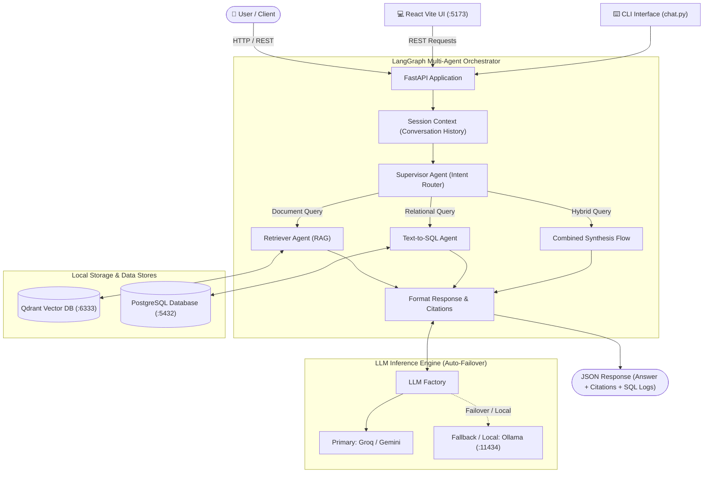

# Local GenAI Data Assistant

An enterprise-grade, fully local GenAI assistant built with Python, FastAPI, LangGraph, Qdrant, PostgreSQL, Ollama, and React.

The application enables users to converse naturally with both **unstructured enterprise documents** and **relational SQL databases**, orchestrating queries dynamically through a multi-agent LangGraph state machine with automatic failover, safety guardrails, and real-time citations.

---

## 🏛️ System Architecture



---

## ✨ Features & Architecture Highlights

### 1. Document RAG (`data/documents/`)
* **Multi-Format Ingestion:** Natively parses `.pdf`, `.docx`, `.txt`, and `.md` files into clean, structured chunks.
* **FastEmbed Embedding Engine:** Ultra-fast CPU inference using ONNX Runtime with `BAAI/bge-small-en-v1.5` (no multi-gigabyte PyTorch footprint required).
* **Vector Database:** High-performance semantic vector search and metadata filtering powered by **Qdrant**.
* **Similarity Thresholding & Fallback:** Enforces a minimum cosine similarity threshold ($\ge 0.40$). Queries outside the indexed corpus receive constructive, polite guidance with the current knowledge base summary and upload tips (no false citations).
* **Document Management Lifecycle:** Upload files directly through the UI with validation (size up to 25MB, supported formats), and delete documents with dual vector index and filesystem cleanup.

### 2. Relational Text-to-SQL Agent
* **Relational Schema:** PostgreSQL database seeded with `customers`, `products`, `orders`, and `order_items` (`data/sql/init.sql`).
* **Schema-Aware Prompting:** Dynamic introspection reflects live table DDL, types, and column constraints.
* **Security & Guardrails:** Strict SQL validation blocking `DROP`, `DELETE`, `UPDATE`, `INSERT`, `ALTER`, `TRUNCATE`, and multi-statement injection. Only read-only `SELECT` queries are permitted.
* **Self-Healing Loop:** Catches database execution and syntax errors, feeds them back to the LLM, and self-corrects up to 2 retries automatically.
* **Query Diagnostics:** Records execution latency, row counts, and database metadata for auditing.

### 3. Intelligent Agent Supervision (LangGraph)
* **Dynamic Intent Routing:** Classifies user intent into:
  * `general`: Natural conversational dialogue, greetings, pleasantries, dismissals (*"hi"*, *"leave it"*, *"thanks"*).
  * `rag`: Document policies, SLAs, guidelines (*"What is the company leave policy?"*).
  * `sql`: Relational analytics and aggregations (*"Which are the top 5 customers by revenue?"*).
  * `combined`: Questions requiring both (*"What is the refund policy and how much was refunded last month?"*).
* **Real-Time Output & Event Streaming (SSE):** Streams agent lifecycle status steps (`"Analyzing query intent..."`, `"Searching knowledge base..."`, `"Inspecting database schema..."`) and output tokens in real-time via `POST /chat/stream`.
* **Multi-Turn Memory:** Preserves conversational context across questions keyed by `session_id`.

### 4. Modern User Interfaces
* **Interactive Web UI:** Modern React + Vite frontend with token streaming, live status spinner, document management sidebar, citation badges, and SQL inspection.
* **Terminal CLI:** Interactive terminal interface via `chat.py` or `make run-cli`.
* **REST API:** Complete FastAPI REST interface with interactive OpenAPI / Swagger docs at `/docs`.

---

## 📁 Repository Structure

```
.
├── .github/
│   └── workflows/
│       └── ci.yml                  # Automated CI (Python tests, >=80% coverage, Vite build)
├── Dockerfile                      # Production container definition for FastAPI backend
├── docker-compose.yml              # Multi-container orchestration (API, Postgres, Qdrant, Ollama)
├── Makefile                        # Project automation (dev, test, coverage, docker, build)
├── requirements.txt                # Python backend dependencies
├── .env.example                    # Environment variable configuration template
├── chat.py                         # Interactive CLI terminal chat interface
│
├── app/                            # Modular Clean Architecture Backend
│   ├── main.py                     # FastAPI entrypoint, middleware, and lifecycle handlers
│   ├── starter.py                  # Service bootstrap and initialization checks
│   ├── health.py                   # Deep system health diagnostic endpoint
│   ├── agents/                     # LangGraph agents
│   │   ├── base_agent.py           # Base agent abstraction
│   │   ├── supervisor_agent.py     # Intent classification, routing supervisor & event streaming
│   │   └── retriever_agent.py      # Text-to-SQL agent with self-healing loop
│   ├── config/                     # Typed configuration management
│   │   ├── env_config.py           # Environment variables (Pydantic / dotenv)
│   │   ├── log_config.py           # Structured logging setup
│   │   └── qdrant_config.py        # Vector database connection settings
│   ├── constants/                  # Domain constants and error codes
│   ├── exceptions/                 # Custom domain exceptions and HTTP exception handlers
│   ├── llms/                       # LLM abstraction layer
│   │   └── llm_factory.py          # Unified factory supporting Groq, Gemini, and Ollama
│   ├── prompts/                    # Prompt engineering templates (supervisor, retrieval, SQL)
│   ├── repository/                 # Data access layer
│   │   └── vector_repository/      # Qdrant vector database repository
│   ├── routes/                     # API endpoint definitions
│   │   └── core_routes/            # /chat, /chat/stream, /documents/upload, /documents/ingest
│   ├── schemas/                    # Pydantic request and response contracts
│   ├── services/                   # Business domain services (ingestion, retrieval)
│   ├── tools/                      # Agent tool definitions (retriever_tool)
│   ├── utils/                      # Low-level utilities
│   │   ├── core_utils/             # db_utils, embedding_utils (FastEmbed), file_utils
│   └── tests/                      # Automated test suite (83 tests, >=80% coverage)
│       ├── unit/                   # Unit test suite
│       ├── routes/                 # Endpoint and integration tests
│       └── benchmark/              # Accuracy and security benchmark tests
│
├── data/
│   ├── documents/                  # Business knowledge base (.pdf, .docx, .txt, .md)
│   └── sql/
│       └── init.sql                # PostgreSQL analytics schema and seed records
│
├── frontend/                       # Interactive React + Vite frontend dashboard
│   ├── src/                        # React components, chat hooks, and styles
│   ├── package.json                # Frontend dependencies
│   └── vite.config.js              # Vite configuration with proxy to FastAPI (:8000)
│
└── scripts/
    └── check_coverage.py           # Automated test coverage analysis script
```

---

## ⚡ Quick Start with `make`

The repository includes a comprehensive `Makefile` to simplify common development, testing, and Docker operations:

```bash
make help
```

### Common Commands:

| Command | Description |
| :--- | :--- |
| `make dev` / `make run` | Run FastAPI backend locally with hot-reload on `http://localhost:8000` |
| `make dev-frontend` | Run React frontend locally with hot-reload on `http://localhost:5173` |
| `make build-frontend` | Build optimized React production bundle into `frontend/dist` |
| `make run-cli` | Launch the interactive terminal chat interface |
| `make test` | Run the full test suite (`app/tests`) |
| `make test-verbose` | Run the test suite with detailed per-test output |
| `make coverage` | Generate statement coverage report for the application |
| `make benchmark` | Execute quantitative intent routing and SQL security benchmarks |
| `make docker-up` | Build and start all Docker containers (API, DB, Qdrant, Ollama) |
| `make docker-up-d` | Start all Docker containers in background (detached mode) |
| `make docker-down` | Stop and remove all project containers |
| `make clean` | Clean up `__pycache__`, `.pyc`, and temporary build artifacts |

---

## 🚀 Running the Project

### Option 1: Full Stack via Docker Compose (Recommended)

Start the API, PostgreSQL database, Qdrant vector store, and Ollama in containers:
```bash
make docker-up-d
```

Services exposed:
* **FastAPI Backend & Swagger Docs:** [http://localhost:8000/docs](http://localhost:8000/docs)
* **Qdrant Vector Dashboard:** [http://localhost:6333/dashboard](http://localhost:6333/dashboard)
* **PostgreSQL:** `localhost:5432` (`ai_analytics`)
* **Ollama Service:** [http://localhost:11434](http://localhost:11434)

To download a local model in Ollama:
```bash
docker exec -it ai_ollama ollama pull llama3.2
```

---

### Option 2: Local Python + Frontend Development

#### 1. Setup Environment
```bash
# Clone and enter directory
cd AI

# Create and activate virtual environment
python3 -m venv .venv
source .venv/bin/activate

# Install dependencies
pip install -r requirements.txt

# Configure environment variables
cp .env.example .env
```

#### 2. Start Services & Applications
```bash
# Start backend (port 8000)
make dev

# In a separate terminal, start frontend (port 5173)
make dev-frontend
```

---

## 📡 API Documentation & Sample Requests

### 1. Conversational Chat (`POST /chat`)

#### Text-to-SQL Query:
```bash
curl -X POST http://localhost:8000/chat \
  -H "Content-Type: application/json" \
  -d '{
    "message": "Which are the top 5 customers by revenue?",
    "session_id": "user_session_1"
  }'
```

#### Document Policy Query:
```bash
curl -X POST http://localhost:8000/chat \
  -H "Content-Type: application/json" \
  -d '{
    "message": "What is the company leave policy?",
    "session_id": "user_session_1"
  }'
```

#### Hybrid Document + SQL Query:
```bash
curl -X POST http://localhost:8000/chat \
  -H "Content-Type: application/json" \
  -d '{
    "message": "What is the refund policy and how much was refunded last month?",
    "session_id": "user_session_1"
  }'
```

---

### 2. Real-Time Streaming Chat (`POST /chat/stream`)

Streams live operational events and token-by-token output using **Server-Sent Events (SSE)**:

```bash
curl -N -X POST http://localhost:8000/chat/stream \
  -H "Content-Type: application/json" \
  -d '{
    "message": "What is the company leave policy?",
    "session_id": "user_session_1"
  }'
```

**SSE Event Types Yielded:**
* `status`: Current agent step (`{"type": "status", "step": "Searching knowledge base in vector database..."}`)
* `intent`: Intent classification (`{"type": "intent", "intent": "rag"}`)
* `sources`: Retrieved context files (`{"type": "sources", "sources": ["leave_policy.txt"]}`)
* `sql_query`: Executed database query & latency (`{"type": "sql_query", "query": "SELECT...", "logs": {...}}`)
* `token`: Real-time text chunks (`{"type": "token", "content": "Employees "}`)
* `done`: Final aggregated payload (`{"type": "done", "final_answer": "...", ...}`)

---

### 3. Document Knowledge Base Ingestion & Management

* **Upload a document (.pdf, .docx, .txt, .md with pre-upload validation):**
  ```bash
  curl -X POST http://localhost:8000/documents/upload \
    -F "file=@data/documents/leave_policy.txt"
  ```
* **Ingest all existing files in `data/documents/`:**
  ```bash
  curl -X POST http://localhost:8000/documents/ingest
  ```
* **List indexed documents:**
  ```bash
  curl -X GET http://localhost:8000/documents
  ```
* **Delete a document (removes from Qdrant vector index and filesystem):**
  ```bash
  curl -X DELETE http://localhost:8000/documents/leave_policy.txt
  ```

---

### 4. Diagnostics & Health Check (`GET /health`)
```bash
curl -X GET http://localhost:8000/health
```

---

## 🔄 Continuous Integration (CI/CD)

The project includes automated quality gate enforcement via **GitHub Actions** (`.github/workflows/ci.yml`):
* **Backend Automated Suite:** Runs all 83 unit, integration, and benchmark tests on Python 3.12.
* **Code Coverage Gate:** Strictly enforces statement coverage $\ge 80.0\%$ using `scripts/check_coverage.py`.
* **Frontend Build Check:** Validates that the React Vite application bundles into production without syntax or packaging errors (`npm ci && npm run build`).
* **Triggers:** Automatically executes on pushes to `main`, `dev`, and `feature/**` branches, and on Pull Requests.

## 🔒 Security & Safety Controls

1. **Air-Gapped & Privacy-Centric:** All business data and vector embeddings can operate strictly inside your private network without external API dependencies when using Ollama.
2. **SELECT-Only AST Enforcement:** SQL queries generated by the agent pass through validation filters blocking destructive statements (`DROP`, `DELETE`, `UPDATE`, `INSERT`, `ALTER`, `TRUNCATE`).
3. **Multi-Statement Injection Prevention:** Disallows multiple semicolon-delimited SQL commands.
4. **Self-Healing Resilience:** If a generated SQL query encounters syntax or table errors, the error context is analyzed and re-prompted automatically up to 2 retries.

---

## 🧪 Testing & Benchmarks

Run the automated test suite with coverage:
```bash
# Run unit and route tests
make test

# Generate coverage metrics
make coverage

# Run intent routing & security accuracy benchmarks
make benchmark
```
